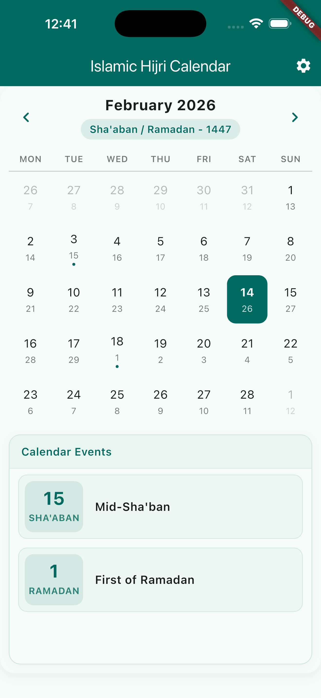
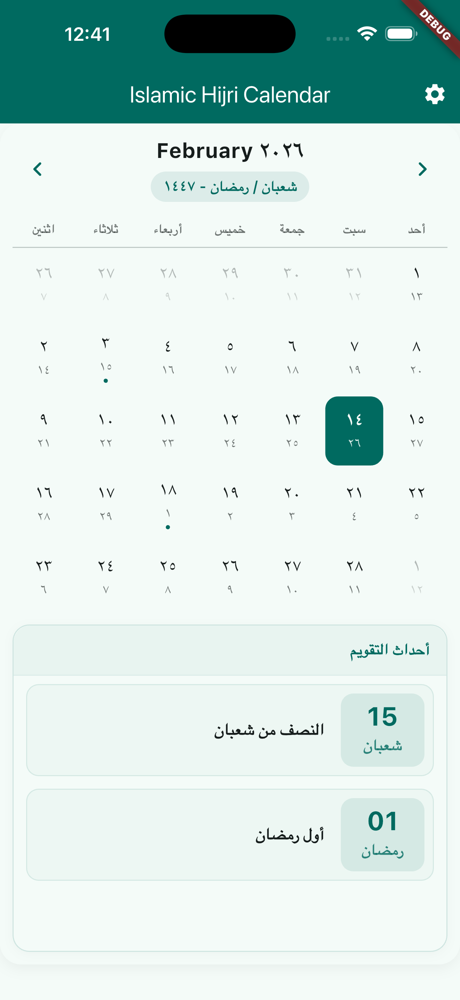

# Islamic Hijri Calendar (Rohingya Edition)

A beautiful, modern Flutter widget for displaying the Islamic Hijri Calendar with multi-language support (Rohingya, English, Arabic), automatic Islamic events display, and extensive customization options.

## ✨ Features

### 🌍 Multi-Language Support
- **Three Languages**: Rohingya, English, and Arabic
- **Localized Content**: Month names, weekdays, numerals, and UI strings
- **Smart Text Direction**: Automatic LTR/RTL layout based on language
- **Native Numerals**: Hanifi script, Arabic-Indic, and Western numerals

### 📅 Islamic Events
- **Automatic Detection**: Displays important Islamic dates for the current month
- **Beautiful Cards**: Modern event cards with date boxes and localized names
- **Major Events**: Ramadan, Eid al-Fitr, Eid al-Adha, Mawlid al-Nabi, Laylat al-Qadr, and more
- **Localized Names**: Event names in all supported languages

### 🎨 Modern UI Design
- **Professional Interface**: Clean, cohesive design with unified events section
- **Responsive Layout**: Adapts to mobile (column) and tablet/desktop (row) layouts
- **Customizable Colors**: Full theme support for light and dark modes
- **Google Fonts**: Built-in support for custom and Google Fonts

### ⚙️ Flexible Configuration
- **Dual Calendar View**: Show Hijri dates alongside Gregorian dates
- **Date Adjustment**: User-configurable Hijri date adjustment (-3 to +3 days)
- **Custom Styling**: Extensive color and typography customization
- **Date Selection**: Callbacks for both Gregorian and Hijri date selection

## 📦 Installation

Add this to your `pubspec.yaml`:

```yaml
dependencies:
  islamic_hijri_calendar_rhg: ^1.0.0
```

Then run:

```bash
flutter pub get
```

## 🚀 Usage

### Basic Example

```dart
import 'package:islamic_hijri_calendar_rhg/islamic_hijri_calendar_rhg.dart';

IslamicHijriCalendar(
  locale: 'en', // 'en', 'ar', or 'rhg' (Rohingya)
  isHijriView: true,
  highlightBorder: Theme.of(context).colorScheme.primary,
  defaultBorder: Theme.of(context).colorScheme.onSurface.withValues(alpha: 0.1),
  highlightTextColor: Theme.of(context).colorScheme.surface,
  defaultTextColor: Theme.of(context).colorScheme.onSurface,
  defaultBackColor: Theme.of(context).colorScheme.surface,
  adjustmentValue: 0,
  isGoogleFont: true,
  fontFamilyName: "Noto Sans Rohingya",
  getSelectedEnglishDate: (selectedDate) {
    print("English Date: $selectedDate");
  },
  getSelectedHijriDate: (selectedDate) {
    print("Hijri Date: $selectedDate");
  },
  isDisablePreviousNextMonthDates: true,
)
```

### Language Switching Example

```dart
String _locale = 'en'; // Default to English

// In your settings or language selector
DropdownButton<String>(
  value: _locale,
  items: const [
    DropdownMenuItem(value: 'en', child: Text("English")),
    DropdownMenuItem(value: 'ar', child: Text("Arabic")),
    DropdownMenuItem(value: 'rhg', child: Text("Rohingya")),
  ],
  onChanged: (value) {
    setState(() {
      _locale = value!;
    });
  },
)

// Use in calendar
IslamicHijriCalendar(
  locale: _locale,
  // ... other parameters
)
```

## 📋 Properties

| Property | Type | Required | Description |
|----------|------|----------|-------------|
| `locale` | `String` | ✅ Yes | Language code: `'en'`, `'ar'`, or `'rhg'` |
| `isHijriView` | `bool?` | No | Show Hijri dates alongside Gregorian (default: `true`) |
| `highlightBorder` | `Color?` | No | Border color for selected/today dates |
| `defaultBorder` | `Color?` | No | Border color for regular dates |
| `highlightTextColor` | `Color?` | No | Text color for today's date |
| `defaultTextColor` | `Color?` | No | Text color for regular dates |
| `defaultBackColor` | `Color?` | No | Background color for the calendar |
| `adjustmentValue` | `int` | No | Hijri date adjustment in days (-3 to +3, default: `0`) |
| `isGoogleFont` | `bool?` | No | Use Google Fonts (default: `false`) |
| `fontFamilyName` | `String?` | No | Custom or Google Font family name |
| `getSelectedEnglishDate` | `Function(DateTime)?` | No | Callback when a date is selected (Gregorian) |
| `getSelectedHijriDate` | `Function(HijriDate)?` | No | Callback when a date is selected (Hijri) |
| `isDisablePreviousNextMonthDates` | `bool?` | No | Disable dates from previous/next months (default: `false`) |

## 🌐 Supported Languages

| Language | Code | Script | Example |
|----------|------|--------|---------|
| English | `en` | Latin | January, 1, 2 |
| Arabic | `ar` | Arabic | محرم، ١، ٢ |
| Rohingya | `rhg` | Hanifi | 𐴔𐴟𐴇𐴝𐴌𐴝𐴔, 𐴱, 𐴲 |

## 📅 Islamic Events

The calendar automatically displays these important Islamic dates:

- **Muharram 1**: Islamic New Year (رأس السنة الهجرية)
- **Muharram 10**: Ashura (عاشوراء)
- **Rabi' al-Awwal 12**: Mawlid al-Nabi (المولد النبوي)
- **Rajab 27**: Isra and Mi'raj (الإسراء والمعراج)
- **Sha'ban 15**: Mid-Sha'ban (النصف من شعبان)
- **Ramadan 1**: First of Ramadan (أول رمضان)
- **Ramadan 27**: Laylat al-Qadr (ليلة القدر)
- **Shawwal 1**: Eid al-Fitr (عيد الفطر)
- **Dhul Hijjah 9**: Day of Arafah (يوم عرفة)
- **Dhul Hijjah 10**: Eid al-Adha (عيد الأضحى)

## 🎨 Screenshots

<table>
  <tr>
    <td align="center">
      
      <br/>
      <em>English (en)</em>
    </td>
    <td align="center">
      
      <br/>
      <em>Arabic (ar)</em>
    </td>
    <td align="center">
      
      <br/>
      <em>Rohingya (rhg)</em>
    </td>
  </tr>
</table>

*Calendar displaying February 2026 with Islamic events (Mid-Sha'ban and First of Ramadan) in three languages*

## 💡 Tips

- **Font Selection**: For Rohingya, use "Noto Sans Rohingya" from Google Fonts
- **Responsive Design**: The calendar automatically adapts to screen size (column layout < 600px, row layout ≥ 600px)
- **Theme Integration**: Use `Theme.of(context)` colors for seamless integration with your app's theme
- **Date Adjustment**: Some regions may need ±1 or ±2 day adjustment for Hijri dates

## 🔄 Migration from 0.0.x

Version 1.0.0 introduces breaking changes:

```dart
// Before (0.0.x - islamic_hijri_calendar)
IslamicHijriCalendar(
  isHijriView: true,
  // ... other parameters
)

// After (1.0.0 - islamic_hijri_calendar_rhg)
IslamicHijriCalendar(
  locale: 'en', // NEW: Required parameter
  isHijriView: true,
  // ... other parameters
)
```

## 🤝 Contributing

Contributions are welcome! Please read our [Contributing Guidelines](CONTRIBUTING.md) before submitting a Pull Request.

For detailed API documentation, see [API.md](API.md).

## 📄 License

This project is licensed under the MIT License - see the [LICENSE](LICENSE) file for details.

## 🙏 Acknowledgments

- Umm al-Qura calendar data for accurate Hijri date conversion
- Google Fonts for Rohingya typography support
- The Flutter community for inspiration and feedback

---

> Made with ❤️ for the Rohingya community